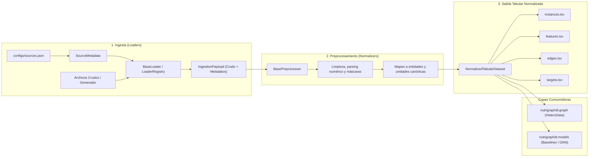

# Especificación de Diseño del Módulo de Datos

## 1. Estado, autoridad y contexto

- **Módulo:** `nutrigraphdt.data`
- **Componente:** Pipeline de datos (`ingesta → preprocesamiento → salida tabular normalizada`)
- **Versión de especificación:** `1.0.0`
- **Fuentes de referencia:**
  - *Actividad 26:* Dataset sintético multicapa y generador (`docs/synthetic-dataset-spec.md`).
  - *Actividades 15 y 19 de Investigación:* Revisión de repositorios y selección de datasets (`docs/Repositorios y Datasets — PIA Microbioma Digital.md`).
  - *Arquitectura del sistema:* Límites de módulos y dirección de dependencias (`docs/architecture.md`).
- **Estado de revisión:**
  - **Autor:** Área de Desarrollo (NutriGraphDT)
  - **Revisores designados:** Equipo de Desarrollo e Investigación (PIA Microbioma Digital, UTEM 2026-II)
  - **Estado:** Integrada en `main` (PR #49) y en revisión. La aprobación de al menos un
    integrante queda registrada en GitHub (sección 9). El CI remoto no se ejecuta en este
    repositorio, por lo que la evidencia de verificación son los checks locales
    (`docs/cost-policy.md`).

---

## 2. Propósito y objetivos arquitectónicos

El módulo de datos es responsable de ingerir información heterogénea procedente de múltiples orígenes (tanto el dataset sintético de la Actividad 26 como los conjuntos de datos públicos priorizados por Investigación para aves y cerdos), transformarla bajo reglas reproducibles y producir una **salida tabular normalizada e intermedia**.

Este diseño garantiza:
1. **Desacoplamiento entre ingesta y grafos:** La capa de grafo (`nutrigraphdt.graph`) y los modelos (`nutrigraphdt.models`) no dependen del formato crudo de los archivos originales (JSONL, TSV, CSV, FASTQ, BIOM, mzML), sino de un contrato tabular unificado.
2. **Soporte dual e intercambiable:** El pipeline opera de manera transparente tanto con el dataset sintético de desarrollo (`synthetic-v1`) como con las fuentes reales identificadas en el relevamiento de Investigación (HoloFood D1, Utkina et al. D2, Plata et al. D3, Beauclercq et al. D4, MGnify D7, PIGC D8).
3. **Trazabilidad científica y metadatos explícitos:** Cada registro preserva su procedencia (`source_id`), condición sintética o real (`is_synthetic`), especie biológica (`species`), segmento del tracto gastrointestinal (`gut_segment`), y unidad de medida estandarizada.
4. **Política de costo cero:** Todo el procesamiento se realiza localmente utilizando herramientas libres y de código abierto en Python 3.11+, sin requerir servicios en la nube ni pagos de suscripciones.

---

## 3. Flujo del pipeline

El ciclo de vida de los datos se articula en tres etapas secuenciales y modulares:



### 3.1. Fase 1: Ingesta (`BaseLoader`)
- Lee la configuración de la fuente desde `configs/sources.json`.
- El cargador especializado correspondiente (hoy `AbundanceLoader`, sección 4.3) accede al archivo o genera los datos.
- Emite un objeto `IngestionPayload`, que encapsula la estructura cruda, los metadatos de procedencia (`SourceMetadata`) y estadísticas de lectura.

### 3.2. Fase 2: Preprocesamiento (`BasePreprocessor`)
- Interpreta las columnas o atributos específicos de la fuente. En A34-4: registros de
  abundancia de `AbundanceLoader`, con asignación del `graph_id` de cada muestra.
- Aplica validación estricta de números finitos (rechazando `NaN` e infinitos). En A34-4: un
  `NaN` o `None` se trata como valor faltante y los negativos se descartan.
- Asigna banderas de calidad (`quality_flag: valid, missing, imputed, below_lod`). A34-4 emite
  `valid` e `imputed`; `missing` y `below_lod` quedan pendientes hasta que una fuente informe
  esos estados.
- Homologa los identificadores y atributos a los vocabularios canónicos del proyecto.
  Pendiente: hoy los identificadores llegan normalizados por los loaders y no se mapean a un
  vocabulario de taxa.
- Normaliza, filtra y registra cada fila descartada con su motivo (sección 4.4).

### 3.3. Fase 3: Salida tabular normalizada (`NormalizedTabularDataset`)
- Ensambla cuatro tablas normalizadas con integridad referencial verificada entre `graph_id` y entidades.
- Permite la exportación a disco en formatos delimitados tabulares (`.tsv` o `.csv`) y la serialización a diccionarios.
- Constituye el punto de entrada para el constructor de grafos heterogéneos (`nutrigraphdt.graph.heterodata`).

---

## 4. Interfaz común de cargadores

### 4.1. Clase base `BaseLoader`
Ubicación: `src/nutrigraphdt/data/loaders/base.py`

```python
class BaseLoader(ABC):
    """Interfaz abstracta común para todos los cargadores de datos."""

    def __init__(self, metadata: SourceMetadata) -> None:
        self._metadata = metadata

    @property
    def metadata(self) -> SourceMetadata:
        """Metadatos de la fuente asociada."""
        return self._metadata

    @abstractmethod
    def load(self, source_path: Path | str | None = None) -> IngestionPayload:
        """Carga y estructura los datos crudos desde disco o memoria."""
        raise NotImplementedError

    def resolve_path(self, source_path: Path | str | None = None) -> Path:
        """Resuelve y verifica la existencia de la ruta configurada."""
        ...
```

### 4.2. Metadatos de la fuente (`SourceMetadata`)
Registra todos los atributos necesarios para trazabilidad científica y selección de lógica de normalización:

| Campo | Tipo | Obligatorio | Descripción |
|---|---|:---:|---|
| `source_id` | `str` | Sí | Identificador único de la fuente (ej. `synthetic-v1`, `D1_holofood`). |
| `name` | `str` | Sí | Nombre descriptivo del dataset o estudio. |
| `species` | `str` | Sí | Especie animal evaluada (`chicken` o `pig`). |
| `gut_segment` | `str` | Sí | Segmento anatómico (`cecum`, `ileum`, `jejunum`, `colon`, `feces`, `serum`, `multi`). |
| `data_types` | `tuple[str, ...]` | Sí | Tipos de datos cubiertos (`microbiome`, `metabolome`, `diet`, `phenotype`, `genome_catalog`). |
| `format` | `str` | Sí | Formato físico de intercambio (`jsonl`, `tsv`, `csv`, `biom`, `fasta`). |
| `path_or_url` | `str \| None` | No | Ruta local relativa o enlace persistente de acceso. |
| `is_synthetic` | `bool` | Sí | Indicador de procedencia sintética (`True`) o real (`False`). |
| `version` | `str` | Sí | Versión del dataset o versión del esquema. |
| `description` | `str` | No | Resumen metodológico y alcance de los datos. |
| `citation_or_url` | `str` | No | DOI, identificador de repositorio o publicación revisada por pares. |
| `options` | `dict[str, Any]` | No | Parámetros específicos de parsing (delimitador, codificación, semillas). |

### 4.3. Implementaciones provistas y planificadas

| Componente | Estado | Issue |
|---|---|---|
| `AbundanceLoader` (`loaders/abundance.py`) | Implementado | A34-2 (#25) |
| `MetaboliteLoader` (`loaders/metabolite.py`) | Implementado | A34-3 (#26) |
| `MetadataLoader` (`loaders/metadata.py`) | Implementado | A34-3 (#26) |
| `BasePreprocessor` y `AbundancePreprocessor` (`preprocessors/`) | Implementado | A34-4 (#27) |
| `DataPipeline` (`pipeline.py`) | Implementado | A34-4 (#27) |

**`AbundanceLoader`** lleva tablas de abundancia taxonómica al formato intermedio
(muestra, taxón, abundancia). Lee dos tipos de fuente:

- Tablas TSV/CSV exportadas desde HoloFood/MGnify (16S o shotgun), con taxa en filas
  (`orientation: "taxa_rows"`, por defecto) o en columnas (`"taxa_cols"`). MGnify escribe el
  encabezado como `#SampleID`; para esas tablas se configura `comment_char: ""` y
  `taxon_column: "#SampleID"`.
- El dataset sintético de la Actividad 26 (`format: "jsonl"`), leído con `load_dataset` o, si
  la fuente declara `generate_if_missing`, generado en memoria con `generate_scenario_dataset`.

Cada registro de `IngestionPayload.raw_data` tiene estas claves:

| Clave | Tipo | Descripción |
|---|---|---|
| `graph_id` | `str \| None` | Grafo de origen. Solo se conoce en el dataset sintético, donde los dos escenarios comparten `sample_id`; en tablas reales es `None` hasta el preprocesamiento. |
| `sample_id` | `str` | Identificador de muestra normalizado: sin espacios externos y con los internos reemplazados por `_`. |
| `taxon_id` | `str` | Nombre del rango más profundo con nombre del linaje (prefijos `sk__`/`d__`/`k__`/`p__`/`c__`/`o__`/`f__`/`g__`/`s__`/`t__`, separados por `;` o `\|`), o el identificador tal cual si no tiene prefijos. |
| `taxon_level` | `str` | Rango del taxón (`domain` … `strain`, `clade`, `otu` o `unknown`). Los identificadores sin prefijo usan la opción `taxon_level` (por defecto `unknown`). |
| `value` | `float` | Abundancia finita y no negativa; relativa por muestra si `normalize` es verdadera. |
| `unit` | `str` | `relative_abundance` u opción `unit` cuando `normalize` es falsa. |
| `source_id`, `species`, `gut_segment` | `str` | Procedencia copiada de `SourceMetadata`. |

**Errores de lectura.** Las celdas no numéricas o no finitas se omiten. Los valores negativos
se llevan a 0. Las filas con un número de columnas distinto del encabezado y los identificadores
vacíos o duplicados se omiten; un taxón repetido en una muestra se suma. Cada caso se registra
con `logging` (logger `nutrigraphdt.data.loaders.abundance`) y en
`IngestionPayload.extra["errors"]`, sin detener el pipeline. Un archivo ilegible (codificación,
permisos, CSV malformado o dataset sintético corrupto) produce un payload vacío con el error
registrado. Solo levanta excepción una configuración inválida: ruta inexistente, `orientation`
o `taxon_level` desconocidos, u opciones booleanas no interpretables.

Las opciones booleanas (`normalize`, `generate_if_missing`) se interpretan con
`parse_bool_option`, que acepta booleanos JSON, `0`/`1` y textos como `"true"`/`"false"`.

**`MetaboliteLoader`** lee perfiles de metabolitos (formato MetaboLights simplificado, con
metabolitos en filas o en columnas). Cada registro tiene `sample_id`, `metabolite_id` (nombre
original), `canonical_id`, `value`, `unit` y la procedencia. `canonical_id` se obtiene de
`map_metabolite_name` con prioridad para acetato, propionato y butirato (nombres, KEGG y
ChEBI); un nombre sin mapeo queda como slug en minúsculas. La unidad declarada en la opción
`unit` se homologa con `normalize_unit`. Una unidad sin equivalente en `CANONICAL_UNITS`
levanta `ValueError`. µmol/g se convierte a mmol/kg con factor 1. mM y mg/kg se conservan,
porque convertirlos requiere densidad o masa molar.

**`MetadataLoader`** lee metadatos de dieta y fenotipo por muestra. Cada registro tiene
`sample_id`, `field`, `value` (numérico o categórico), `unit`, `field_type` (`diet`,
`phenotype`, `numeric` o `categorical`, inferido del nombre de la columna u opción
`column_types`) y la procedencia. Las unidades de `column_units` y `default_unit` deben
pertenecer a `CANONICAL_UNITS`.

Ambos loaders siguen la misma política de errores de lectura que `AbundanceLoader`. Las
celdas vacías son datos faltantes sin error. Los valores no finitos se omiten; la finitud se
comprueba antes del clamp de negativos a 0, porque `max(0.0, nan)` devuelve `0.0`.

### 4.4. Preprocesamiento y control de calidad de abundancias (A34-4)

Ubicación: `src/nutrigraphdt/data/preprocessors/`. `BasePreprocessor.process(payload)` recibe
un `IngestionPayload` y devuelve un `PreprocessedData` con filas de `instances`, filas de
`features` y un `PreprocessingReport`. No modifica el payload y, con la misma entrada y la
misma configuración, devuelve siempre la misma salida. Tampoco depende del orden de los
registros: las sumas usan `math.fsum`, los conflictos no eligen un registro según su posición y
las tablas se ordenan.

`AbundancePreprocessor` procesa la salida de `AbundanceLoader` en cinco etapas. Las reglas
marcadas **(P)** son decisiones de implementación provisionales: no provienen de una fuente
científica ni de un requisito aprobado y deben revisarse con Investigación.

1. **Validación y valores faltantes.** Un valor `None` o `NaN` se descarta
   (`missing_strategy="drop"`) o se imputa como 0 con `quality_flag="imputed"`
   (`missing_strategy="zero"`) **(P)**. Se descartan los registros sin `sample_id` o
   `taxon_id`, con valor no numérico, infinito, negativo o no representable, o con una unidad
   fuera de `relative_abundance`, `reads_per_million` y `copies_per_gram`.
2. **Conflictos e identificador de grafo.** Cada muestra es una instancia. Si el loader no
   conoce el `graph_id` (tablas reales), se asigna `"<source_id>:<sample_id>"`; el sintético
   conserva el suyo. Si un `graph_id` aparece con más de una muestra en cualquier registro con
   identificadores válidos, se descartan todos sus registros. Un valor imputado no compite con
   un valor medido del mismo taxón y grafo: se descarta como faltante. Si aun así un taxón
   tiene más de un valor en el mismo grafo, se descartan todos esos valores **(P)**.
   `AbundanceLoader` ya suma los taxa repetidos, así que estos casos solo aparecen con otros
   orígenes de datos.
3. **Abundancia relativa por muestra.** Cada valor se divide por el total de la muestra. Si la
   unidad ya es `relative_abundance` y la suma no supera 1 (tolerancia `1e-6`, la de
   `AbundanceLoader`), los valores se conservan: la fracción no asignada no se reparte. Una
   muestra con total 0 se descarta (`empty_sample`) y una que mezcla unidades, completa
   (`invalid_record`) **(P)**.
4. **Filtro de taxa.** Un taxón está presente en una muestra si su abundancia relativa es
   mayor que 0 y al menos `min_abundance` **(P)**. Se conserva si está presente en una fracción
   de las instancias de la fuente mayor o igual que `min_prevalence` **(P)**. La prevalencia se
   cuenta sobre instancias (`graph_id`), no sobre muestras biológicas: en el sintético, el
   escenario basal y el intervenido comparten `sample_id` y cuentan dos veces. Los taxa
   conservados no se renormalizan, así que la suma por muestra puede quedar bajo 1
   (sección 6.5) **(P)**.
5. **Transformación de salida.** `"relative"` entrega `feature_name="abundance"` en
   `relative_abundance`. `"clr"` entrega `feature_name="abundance_clr"` en `dimensionless`:
   $\mathrm{clr}(x)_i = \ln(x_i + p) - \frac{1}{D}\sum_{j=1}^{D} \ln(x_j + p)$, con $x$ la
   abundancia relativa, $p$ el pseudoconteo sumado a cada componente **(P)** y $D$ el número
   de taxa conservados de la fuente. Todas las muestras usan el mismo conjunto de taxa, para
   que el valor de un taxón sea comparable entre muestras; un taxón sin valor en una muestra
   (ausente o descartado) cuenta como 0 en ella **(P)**, pero no genera una fila. Por eso la
   suma de las filas emitidas de una muestra solo es 0 cuando la muestra informa todos los
   taxa. Un cero imputado también entra en la media geométrica de su muestra. Si el filtro
   deja un solo taxón, todos los valores CLR son 0 y se emite una advertencia.

**Parámetros** (`AbundancePreprocessingConfig`):

| Parámetro | Defecto | Descripción |
|---|---|---|
| `normalization` | `"relative"` | `"relative"` o `"clr"`. |
| `clr_pseudocount` | sin valor | Constante positiva sumada antes del logaritmo; obligatoria con `"clr"`. |
| `min_prevalence` | `0.0` | Fracción mínima de instancias, en [0, 1], en que el taxón debe estar presente. |
| `min_abundance` | `0.0` | Abundancia relativa mínima, en [0, 1], para contar presencia. |
| `missing_strategy` | `"drop"` | `"drop"` o `"zero"`. |

Los valores por defecto no eliminan ningún taxón y CLR no tiene pseudoconteo por defecto: los
umbrales de filtrado y el pseudoconteo cambian el resultado y son decisiones metodológicas que
debe fijar Investigación para cada estudio. Se declaran en código o, por fuente, en
`options["preprocessing"]` de `configs/sources.json`; una clave desconocida es un error.

**Informe y filas descartadas.** Cada registro que no llega a la salida queda en
`PreprocessingReport.discarded` con su posición en `raw_data`, el motivo y una copia del
registro (para `filtered_taxon`, solo `graph_id`, `sample_id`, `taxon_id`, `value` y `unit`,
porque en tablas reales esos descartes pueden ser muchos). También se escribe en el log
`nutrigraphdt.data.preprocessors.abundance`: una advertencia por registro inválido o faltante
y un aviso por taxón filtrado. Se cumple `input_records == output_records + len(discarded)`.

| Motivo | Causa |
|---|---|
| `missing_value` | Valor faltante con `missing_strategy="drop"`, o imputable cuando el taxón ya tiene un valor medido en el grafo. |
| `invalid_record` | Identificador vacío, valor inválido, unidad no admitida, `graph_id` con varias muestras o muestra con unidades mezcladas. |
| `duplicate_record` | Taxón con más de un valor en el mismo grafo (se descartan todos). |
| `empty_sample` | Muestra sin abundancia total positiva. |
| `filtered_taxon` | Taxón eliminado por el filtro de prevalencia y abundancia mínima. |

**Limitación: celdas que `AbundanceLoader` resuelve antes.** El loader (A34-2) lee una celda
vacía como abundancia 0 y omite las celdas no numéricas (por ejemplo `NA`) registrándolas en
`extra["errors"]`. Por eso, en tablas leídas con `AbundanceLoader`, `missing_strategy` no ve
esas celdas: la vacía llega como un 0 medido (`valid`) y la omitida solo aparece en
`PreprocessingReport.loader_errors`. Distinguir una celda vacía de un cero medido requiere que
el loader emita `None`, lo que corresponde a un cambio en A34-2 y no se hace aquí.

**Referencias de la transformación CLR.** Aitchison, J. (1986). *The Statistical Analysis of
Compositional Data*. Chapman and Hall. Gloor, G. B., Macklaim, J. M., Pawlowsky-Glahn, V. y
Egozcue, J. J. (2017). Microbiome Datasets Are Compositional: And This Is Not Optional.
*Frontiers in Microbiology* 8:2224. DOI: 10.3389/fmicb.2017.02224.

### 4.5. Orquestador `DataPipeline` (A34-4)

Ubicación: `src/nutrigraphdt/data/pipeline.py`. `DataPipeline(sources).run(source_ids)`
ejecuta, para cada fuente, tres etapas separadas: el loader que asigna un `LoaderRegistry`
(`default_loader_registry` registra `AbundanceLoader` para `jsonl`, `tsv` y `csv`),
`AbundancePreprocessor` y el ensamblado de un `NormalizedTabularDataset`. Con `output_dir`,
exporta las tablas con `export_tables` (`tsv` por defecto o `csv`, sección 3.3) y escribe
`preprocessing_report.json` con el informe completo de cada fuente.

- Solo acepta fuentes con `microbiome` en `data_types`.
- La configuración de cada fuente es la común del pipeline más `options["preprocessing"]`.
- Una fuente que no produce ninguna instancia (archivo ilegible o filtro que elimina todo) es
  un error: el pipeline no exporta tablas vacías en silencio.
- Para el dataset sintético (`format: "jsonl"`), `study_id`, `scenario_id`, `diet_treatment`
  y `timepoint` se toman de su `instances.jsonl`, o del dataset generado en memoria cuando
  `AbundanceLoader` informa `extra["source_path"] == "generated"` **(P)**. Esta lectura
  depende de ese marcador del loader; una instancia sin contexto se informa en el log y queda
  con `"unknown"`. En las fuentes reales esos campos quedan en `"unknown"` hasta que se
  integren sus metadatos de muestra.
- Dos fuentes que producen el mismo `graph_id` son un error.
- No sobrescribe un `output_dir` con contenido salvo `overwrite=True`, y lo comprueba antes de
  procesar. Al sobrescribir, elimina las tablas e informes de la ejecución anterior en ambos
  formatos y conserva los demás archivos.
- `metadata.json` registra la procedencia de cada fuente, los parámetros de preprocesamiento y
  el resumen de control de calidad; no incluye fechas ni rutas locales, de modo que dos
  ejecuciones con la misma entrada producen archivos idénticos.

**Alcance actual.** El pipeline llena `instances` y `features` (nodos `taxon`). `edges` y
`targets` quedan vacías: las concentraciones de metabolitos son variables objetivo y no
atributos de nodo (sección 6.4), y las relaciones entre entidades no provienen de estas
fuentes. `taxon_level` no se exporta porque `features` no tiene columna para atributos
categóricos.

---

## 5. Configuración de fuentes (`configs/sources.json`)

El archivo `configs/sources.json` actúa como el registro central y versionable de fuentes de datos. `nutrigraphdt.data.config.load_sources` lo lee y devuelve un `SourceMetadata` validado por `source_id`; rechaza las entradas cuya clave no coincide con su `source_id`. Su diseño integra el catálogo evaluado por Investigación en la Tabla 4 de su documento oficial:

```json
{
  "version": "1.0.0",
  "sources": {
    "synthetic-v1": {
      "source_id": "synthetic-v1",
      "species": "chicken",
      "gut_segment": "cecum",
      "data_types": ["microbiome", "metabolome", "diet", "phenotype"],
      "format": "jsonl",
      "path_or_url": "data/synthetic/v1",
      "is_synthetic": true
    },
    "D1_holofood": {
      "source_id": "D1_holofood",
      "name": "HoloFood Chicken Multi-Omic Dataset",
      "species": "chicken",
      "gut_segment": "intestine",
      "data_types": ["microbiome", "metabolome", "phenotype", "diet"],
      "format": "tsv",
      "path_or_url": "data/raw/D1_holofood/samples.tsv",
      "is_synthetic": false
    },
    "D2_prjna902117_utkina": {
      "source_id": "D2_prjna902117_utkina",
      "name": "Chicken Ceca Metagenomes & Metabolic Models",
      "species": "chicken",
      "gut_segment": "cecum",
      "data_types": ["microbiome", "metabolic_model", "diet"],
      "format": "tsv",
      "path_or_url": "data/raw/D2_utkina/abundance_matrix.tsv",
      "is_synthetic": false
    },
    "D3_zenodo_6083555_plata": {
      "source_id": "D3_zenodo_6083555_plata",
      "name": "Chicken Cecal Microbiome under Growth Promoters",
      "species": "chicken",
      "gut_segment": "cecum",
      "data_types": ["microbiome", "metabolome", "phenotype"],
      "format": "tsv",
      "path_or_url": "data/raw/D3_plata/metadata_and_abundances.tsv",
      "is_synthetic": false
    },
    "D4_mtbls560_beauclercq": {
      "source_id": "D4_mtbls560_beauclercq",
      "name": "Chicken Digestive Efficiency Intestinal Metabolomics",
      "species": "chicken",
      "gut_segment": "cecum",
      "data_types": ["metabolome", "phenotype", "diet"],
      "format": "csv",
      "path_or_url": "data/raw/D4_mtbls560/metabolite_concentrations.csv",
      "is_synthetic": false
    },
    "D7_mgnify_chicken_gut": {
      "source_id": "D7_mgnify_chicken_gut",
      "species": "chicken",
      "gut_segment": "intestine",
      "data_types": ["genome_catalog", "functional_annotation"],
      "format": "tsv",
      "is_synthetic": false
    },
    "D8_pigc_chen": {
      "source_id": "D8_pigc_chen",
      "species": "pig",
      "gut_segment": "intestine",
      "data_types": ["genome_catalog", "microbiome"],
      "format": "tsv",
      "is_synthetic": false
    }
  }
}
```

---

## 6. Formato tabular intermedio común: Columnas, tipos y unidades

El formato de salida se materializa en cuatro tablas estructuradas dentro de `NormalizedTabularDataset`:

### 6.1. Tabla `instances` (`instances.tsv`)
Identifica cada grafo / individuo / muestra y su contexto biológico-experimental.

| Columna | Tipo | Restricción / Formato | Descripción |
|---|---|---|---|
| `graph_id` | `str` | Clave primaria única | Identificador único del grafo o muestra en la sesión/dataset. |
| `sample_id` | `str` | Cadena no vacía | Identificador biológico de la muestra en el estudio original. |
| `species` | `str` | `chicken` \| `pig` | Especie animal objeto del estudio. |
| `gut_segment` | `str` | `cecum` \| `ileum` \| `colon` \| etc. | Segmento anatómico de donde se obtuvo la muestra. |
| `study_id` | `str` | Cadena no vacía | Identificador del proyecto, bioproyecto o estudio. |
| `scenario_id` | `str` | `basal` \| `intervention` \| `control` | Escenario experimental de la muestra. |
| `diet_treatment` | `str` | Cadena no vacía | Código o nombre descriptivo de la dieta aplicada. |
| `timepoint` | `str \| None` | Opcional | Día o semana de vida al momento de la toma de muestra. |
| `is_synthetic` | `bool` | `True` \| `False` | Distingue registros sintéticos de observaciones reales. |
| `source_id` | `str` | Cadena no vacía | Identificador de procedencia en `configs/sources.json`. |

### 6.2. Tabla `features` (`features.tsv`)
Almacena todas las mediciones numéricas univariadas asociadas a las entidades del grafo (nodos) para cada muestra.

| Columna | Tipo | Restricción / Formato | Descripción |
|---|---|---|---|
| `graph_id` | `str` | Clave foránea a `instances` | Instancia a la que pertenece la medición. |
| `node_id` | `str` | Cadena no vacía | Identificador único de la entidad en el grafo. |
| `node_type` | `str` | 8 tipos canónicos permitidos | `taxon`, `metabolite`, `function`, `diet`, `additive`, `substrate`, `host`, `phenotype`. |
| `feature_name` | `str` | Cadena no vacía | Nombre de la variable (ej. `abundance`, `concentration`, `dose`). |
| `value` | `float` | Número finito (`math.isfinite`) | Magnitud escalar normalizada (sin `NaN` ni infinitos). |
| `unit` | `str` | Vocabulario canónico | Unidad de medida explícita (ver sección 6.5). |
| `quality_flag` | `str` | `valid` \| `imputed` \| `missing` \| `below_lod` | Estado de calidad del dato. |
| `raw_id` | `str \| None` | Opcional | Identificador original en la base de datos de origen (NCBI, HMDB, KEGG). |
| `source_id` | `str` | Cadena no vacía | Procedencia del dato. |

### 6.3. Tabla `edges` (`edges.tsv`)
Registra las interacciones y relaciones heterogéneas entre entidades.

| Columna | Tipo | Restricción / Formato | Descripción |
|---|---|---|---|
| `graph_id` | `str` | Clave foránea a `instances` | Grafo en el que ocurre la interacción. |
| `src_id` | `str` | Cadena no vacía | Identificador del nodo de origen. |
| `src_type` | `str` | Tipo canónico de nodo | Tipo del nodo de origen. |
| `relation_type` | `str` | Catálogo de relaciones | `produces`, `consumes`, `targets`, `modulates`, `ferments`, `provides`, etc. |
| `dst_id` | `str` | Cadena no vacía | Identificador del nodo de destino. |
| `dst_type` | `str` | Tipo canónico de nodo | Tipo del nodo de destino. |
| `weight` | `float` | Número finito (defecto 1.0) | Ponderación o fuerza de la relación. |
| `evidence_status` | `str` | `synthetic` \| `experimental` \| `literature` \| `inferred` | Nivel de sustento empírico de la relación. |
| `source_id` | `str` | Cadena no vacía | Procedencia de la arista. |

### 6.4. Tabla `targets` (`targets.tsv`)
Variables objetivo supervisadas para entrenamiento, benchmarking y restricciones metabólicas (evitando fuga en los nodos).

| Columna | Tipo | Restricción / Formato | Descripción |
|---|---|---|---|
| `graph_id` | `str` | Clave foránea a `instances` | Grafo de referencia. |
| `target_type` | `str` | Catálogo de targets | `scfa_concentration`, `metabolite_concentration`, `feed_conversion_ratio`, `body_weight_gain`. |
| `target_id` | `str` | Cadena no vacía | Variable específica (ej. `acetate`, `propionate`, `butyrate`, `fcr`). |
| `value` | `float` | Número finito | Valor observado de la variable respuesta. |
| `unit` | `str` | Unidad canónica | Unidad de medida (ej. `mmol_kg`, `ratio`, `g`). |
| `sample_matrix` | `str` | Matriz biológica | `cecal_content`, `ileal_content`, `serum`, `feces`. |
| `measured_or_predicted` | `str` | `measured` \| `predicted` \| `synthetic` | Distingue mediciones directas de simulaciones. |
| `source_id` | `str` | Cadena no vacía | Origen de la medición. |

### 6.5. Catálogo de unidades canónicas aprobadas

Toda magnitud numérica debe viajar con una unidad explícita. Queda prohibido mezclar magnitudes de distintas unidades sin transformación matemática explícita:

1. **Abundancia taxonómica y perfiles de comunidad:**
   - `relative_abundance`: Proporción normalizada en el intervalo $[0, 1]$ (la suma por muestra es $\le 1.0$).
   - `reads_per_million`: Lecturas normalizadas por profundidad de secuenciación.
   - `copies_per_gram`: Cuantificación absoluta por qPCR (copias de ARNr 16S por gramo de digesta).
   - `presence_absence`: Variable binaria $\{0, 1\}$.
2. **Concentraciones metabólicas y químicas:**
   - `mmol_kg`: Milimoles por kilogramo de contenido digestivo húmedo (unidad estándar para AGCC).
   - `umol_g`: Micromoles por gramo de contenido.
   - `mM`: Milimolar (milimoles por litro, para suero o ensayos in vitro).
3. **Dosis y composición de dietas:**
   - `mg_kg`: Miligramos de sustancia activa o aditivo por kilogramo de alimento completo.
   - `g_kg`: Gramos de ingrediente o macronutriente por kilogramo de ración.
   - `proportion`: Fracción másica $[0, 1]$.
   - `CFU_kg`: Unidades formadoras de colonias por kilogramo (para aditivos probióticos).
4. **Desempeño productivo y fenotipos:**
   - `g`: Gramos de ganancia de peso vivo o peso corporal.
   - `ratio`: Índices adimensionales (ej. Índice de Conversión Alimenticia $\text{FCR} = \frac{\text{alimento consumido (g)}}{\text{ganancia de peso (g)}}$).
   - `score`: Puntuaciones o índices normalizados (ej. índice de eficiencia digestiva).

---

## 7. Ejemplo de uso en código

Ingesta disponible hoy (A34-1 y A34-2):

```python
from nutrigraphdt.data.config import load_sources
from nutrigraphdt.data.loaders import AbundanceLoader

sources = load_sources("configs/sources.json")

# 1. Dataset sintético (Actividad 26): si data/synthetic/v1 no existe, se genera en memoria.
payload = AbundanceLoader(sources["synthetic-v1"]).load()
print(payload.records_count, payload.extra["errors"])

# 2. Fuente real (ej. HoloFood D1), cuando el archivo crudo esté en data/raw/.
# payload = AbundanceLoader(sources["D1_holofood"]).load()
```

Pipeline completo (A34-4): ingesta, preprocesamiento y exportación de las tablas.

```python
from nutrigraphdt.data.config import load_sources
from nutrigraphdt.data.pipeline import DataPipeline
from nutrigraphdt.data.preprocessors import AbundancePreprocessingConfig

sources = load_sources("configs/sources.json")

# Abundancia relativa sin filtrar (valores por defecto).
result = DataPipeline(sources).run(["synthetic-v1"], output_dir="data/processed/synthetic-v1")
print(result.dataset.metadata["quality_control"])

# CLR con filtro: los umbrales y el pseudoconteo de este ejemplo son ilustrativos.
config = AbundancePreprocessingConfig(
    normalization="clr", clr_pseudocount=1e-6, min_prevalence=0.1, min_abundance=0.001
)
result = DataPipeline(sources, config=config).run(["synthetic-v1"])
```

---

## 8. Verificación y Criterios de Aceptación

| Criterio | Estado | Evidencia |
|---|:---:|---|
| Clase base `BaseLoader` definida con método `load()` y metadatos | **Cumplido** | `src/nutrigraphdt/data/loaders/base.py` |
| Archivo de configuración de fuentes (ruta, formato y especie) | **Cumplido** | `configs/sources.json`, `src/nutrigraphdt/data/config.py` y `tests/unit/test_data_config.py` |
| Formato tabular intermedio común: columnas, tipos y unidades | **Cumplido** | `src/nutrigraphdt/data/schema.py` |
| Documentación del flujo del pipeline en `docs/` | **Cumplido** | `docs/data-pipeline-design.md` |
| `AbundanceLoader` carga el fixture y el dataset sintético sin errores (A34-2) | **Cumplido** | `tests/unit/test_abundance_loader.py` |
| Checks en verde (`ruff check`, `ruff format --check`, `mypy src`, `pytest`) | **Local** | El CI remoto no se ejecuta; se citan los resultados locales en el PR |
| Documento revisado por al menos un integrante | **Pendiente** | Revisión aprobada en GitHub (sección 9) |
| Normalización relativa y CLR configurable (A34-4) | **Cumplido** | `src/nutrigraphdt/data/preprocessors/abundance.py` y `tests/unit/test_abundance_preprocessor.py` |
| Filtro por prevalencia y abundancia mínima parametrizables (A34-4) | **Cumplido** | `tests/unit/test_abundance_preprocessor.py` (`TestFilter`, `TestSyntheticDataset`) |
| Valores faltantes tratados y filas descartadas registradas (A34-4) | **Cumplido, con limitación** | `PreprocessingReport`, `preprocessing_report.json` y `TestMissingValues`; las celdas vacías o `NA` que resuelve `AbundanceLoader` no llegan como faltantes (sección 4.4) |
| Preprocesamiento reproducible: misma entrada, misma salida (A34-4) | **Cumplido** | `TestReproducibility` y `tests/integration/test_data_pipeline.py` (`TestExport`) |
| `DataPipeline` encadena ingesta, preprocesamiento y exportación (A34-4) | **Cumplido** | `src/nutrigraphdt/data/pipeline.py` y `tests/integration/test_data_pipeline.py` |

---

## 9. Registro de Revisión de Diseño

El criterio de aceptación de A34-1 exige que al menos un integrante revise este documento. La
revisión se registra como una revisión aprobada en GitHub sobre el PR que cierra A34-1 (#24);
este documento no la declara por adelantado.

- **Autor:** Área de Desarrollo (NutriGraphDT).
- **Revisión:** pendiente.
