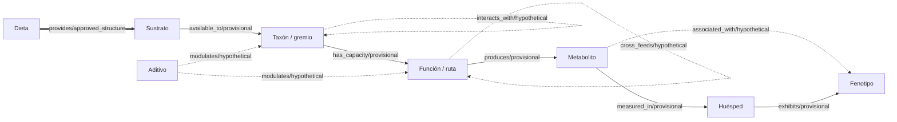

# Diccionario de datos del esquema del grafo

## Glosario

- **Nodo:** elemento representado en el grafo, como una dieta, un taxón o un huésped.
- **Tipo de nodo:** categoría que determina la estructura de un nodo; por ejemplo,
  `metabolite` identifica los nodos de metabolito.
- **Atributo:** dato descriptivo asociado a un nodo o a una relación, como `concentration`.
- **Relación o tripleta:** vínculo dirigido expresado como `(origen, relación, destino)`.
- **Estado estructural:** grado de definición que el esquema asigna a una tripleta:
  `approved_structure` (estructura aprobada), `provisional` (provisional) o
  `hypothetical` (hipotética). No equivale a evidencia biológica.
- **Fuente de datos:** repositorio, conjunto de datos o recurso de anotación que la Tabla 5
  asigna como fuente propuesta para un tipo de nodo. Una asignación no garantiza que la fuente
  aporte todos sus atributos.

## Propósito y alcance

Este documento es una referencia del esquema estructural del grafo para el equipo. Los tipos,
atributos, tipos de dato, campos de unidad, relaciones y estados se transcriben de
[`schema.py`](../src/nutrigraphdt/graph/schema.py). La correspondencia entre tipos de nodo y
fuentes procede exclusivamente de la Tabla 5 de
[`Repositorios y Datasets — PIA Microbioma Digital.md`](Repositorios%20y%20Datasets%20%E2%80%94%20PIA%20Microbioma%20Digital.md).
Los nombres completos de D1, D2, D3, D4, D5, D6, D7 y D13 se muestran según la denominación
del inventario de conjuntos de ese documento.

La versión documentada es `GRAPH_SCHEMA_VERSION = "1.0.0-provisional"`. El esquema es
provisional y no reemplaza la validación de Investigación. En particular, no confirma
ontologías, unidades, magnitudes ni relaciones biológicas; tampoco convierte los estados
estructurales en evidencia de una instancia real.

## Diferencias entre documentos relacionados

- [`graph-schema-v1.md`](graph-schema-v1.md) explica el estado y alcance provisional del
  esquema y las decisiones estructurales pendientes.
- [`synthetic-dataset-spec.md`](synthetic-dataset-spec.md) define el contrato de intercambio
  del dataset sintético: sus campos, tipos, relaciones, serialización y reglas de integridad.
- [`synthetic-dataset-dictionary.md`](synthetic-dataset-dictionary.md) describe los valores y
  convenciones que emite actualmente el generador sintético; no redefine el contrato.

Este diccionario se centra en los atributos del esquema del grafo y en la correspondencia
propuesta con fuentes de datos. No duplica las reglas de intercambio ni los valores sintéticos
de los otros documentos.

## Tipos de nodo y atributos

Los nombres mostrados corresponden a `spanish_name` en `schema.py`. Los tipos de dato son los
tipos de intercambio declarados allí. La columna de unidad indica el campo que porta la unidad,
no una unidad aprobada ni una conversión. `—` significa que el atributo no declara un campo de
unidad. Todos los atributos son provisionales.

| Tipo de nodo | Identificador | Atributo | Tipo de dato | Unidad / campo de unidad | Estado |
|---|---|---|---|---|---|
| Dieta | `diet` | `name` | `str` | — | `provisional` |
| Dieta | `diet` | `ingredients` | `list[str]` | — | `provisional` |
| Dieta | `diet` | `composition` | `list[object]` | `composition[].unit` | `provisional` |
| Dieta | `diet` | `source_version` | `str` | — | `provisional` |
| Aditivo | `additive` | `category` | `str` | — | `provisional` |
| Aditivo | `additive` | `substance` | `str` | — | `provisional` |
| Aditivo | `additive` | `dose` | `number` | `dose_unit` | `provisional` |
| Aditivo | `additive` | `dose_unit` | `str` | — | `provisional` |
| Aditivo | `additive` | `control_label` | `str` | — | `provisional` |
| Sustrato | `substrate` | `chemical_id` | `str` | — | `provisional` |
| Sustrato | `substrate` | `name` | `str` | — | `provisional` |
| Sustrato | `substrate` | `quantity` | `number` | `unit` | `provisional` |
| Sustrato | `substrate` | `unit` | `str` | — | `provisional` |
| Taxón / gremio | `taxon` | `taxonomy_id` | `str` | — | `provisional` |
| Taxón / gremio | `taxon` | `taxonomy_level` | `str` | — | `provisional` |
| Taxón / gremio | `taxon` | `abundance` | `number` | `abundance_unit` | `provisional` |
| Taxón / gremio | `taxon` | `abundance_unit` | `str` | — | `provisional` |
| Taxón / gremio | `taxon` | `quantification_method` | `str` | — | `provisional` |
| Función / ruta | `function` | `function_id` | `str` | — | `provisional` |
| Función / ruta | `function` | `function_type` | `str` | — | `provisional` |
| Función / ruta | `function` | `annotation_source` | `str` | — | `provisional` |
| Función / ruta | `function` | `annotation_value` | `number` | `unit` | `provisional` |
| Función / ruta | `function` | `annotation_value_type` | `str` | — | `provisional` |
| Función / ruta | `function` | `unit` | `str` | — | `provisional` |
| Metabolito | `metabolite` | `chemical_id` | `str` | — | `provisional` |
| Metabolito | `metabolite` | `name` | `str` | — | `provisional` |
| Metabolito | `metabolite` | `sample_matrix` | `str` | — | `provisional` |
| Metabolito | `metabolite` | `concentration` | `number` | `unit` | `provisional` |
| Metabolito | `metabolite` | `unit` | `str` | — | `provisional` |
| Huésped | `host` | `species` | `str` | — | `provisional` |
| Huésped | `host` | `gut_segment` | `str` | — | `provisional` |
| Huésped | `host` | `cohort_id` | `str` | — | `provisional` |
| Huésped | `host` | `covariates` | `object` | — | `provisional` |
| Fenotipo | `phenotype` | `trait` | `str` | — | `provisional` |
| Fenotipo | `phenotype` | `timepoint` | `str` | — | `provisional` |
| Fenotipo | `phenotype` | `value` | `number` | `unit` | `provisional` |
| Fenotipo | `phenotype` | `unit` | `str` | — | `provisional` |

## Fuentes de datos asignadas por tipo de nodo

Las categorías principal y complementaria reproducen la propuesta de la Tabla 5. “Función
metabólica” en esa tabla corresponde a `Función / ruta` (`function`) en `schema.py`;
“Fenotipo productivo” corresponde a `Fenotipo` (`phenotype`). La Tabla 5 no asigna fuentes a
aditivo, sustrato ni huésped, por lo que no se les atribuye ninguna.

| Tipo de nodo (`spanish_name`) | Identificador | Fuentes según Tabla 5 |
|---|---|---|
| Dieta | `diet` | Principal: metadatos de D1 (HoloFood Data Portal). Complementaria: Feedtables y FooDB para traducir dietas a metabolitos. |
| Aditivo | `additive` | sin fuente asignada por Investigación |
| Sustrato | `substrate` | sin fuente asignada por Investigación |
| Taxón / gremio | `taxon` | Principal: D1 (HoloFood Data Portal) y D2 (PRJNA902117 (SRA) + modelos en GitHub). Complementaria: catálogos D5 (colección de Feng et al., 2021), D6 (catálogo de Gilroy et al., 2021) y D7 (MGnify chicken-gut v1.0.1). |
| Función / ruta | `function` | Principal: anotación con KEGG, MetaCyc y CAZy. Complementaria: modelos de D2 y D3 (Zenodo 6083555). |
| Metabolito | `metabolite` | Principal: D1 (HoloFood Data Portal) y D4 (MTBLS560, MetaboLights). Complementaria: D13 (MTBLS13078, MetaboLights). |
| Huésped | `host` | sin fuente asignada por Investigación |
| Fenotipo | `phenotype` | Principal: D1 (HoloFood Data Portal) y D4 (MTBLS560, MetaboLights). Complementaria: D3 (Zenodo 6083555). |

## Relaciones y atributos de arista

Las tripletas, semánticas, atributos obligatorios y estados se copian de
`ALLOWED_RELATIONS` en `schema.py`. `—` indica que la relación no declara atributos
obligatorios. Un campo de unidad solo señala dónde se almacena; no fija una unidad concreta.

| Tripleta (origen, relación, destino) | Semántica | Atributos obligatorios | Estado estructural |
|---|---|---|---|
| (`diet`, `provides`, `substrate`) | Composición documentada de dieta. | `proportion: number` (unidad en `unit`); `unit: str` | `approved_structure` |
| (`substrate`, `available_to`, `taxon`) | Recurso potencialmente disponible. | — | `provisional` |
| (`taxon`, `has_capacity`, `function`) | Capacidad anotada, no actividad demostrada. | `annotation_source: str` | `provisional` |
| (`function`, `produces`, `metabolite`) | Transformación candidata. | — | `provisional` |
| (`metabolite`, `measured_in`, `host`) | Medición o exposición contextual. | `sample_matrix: str` | `provisional` |
| (`additive`, `modulates`, `taxon`) | Hipótesis de modulación. | — | `hypothetical` |
| (`additive`, `modulates`, `function`) | Hipótesis de modulación. | — | `hypothetical` |
| (`metabolite`, `associated_with`, `phenotype`) | Asociación, no efecto causal. | — | `hypothetical` |
| (`host`, `exhibits`, `phenotype`) | Correspondencia observacional. | `timepoint: str` | `provisional` |
| (`taxon`, `interacts_with`, `taxon`) | Interacción ecológica candidata. | `interaction_type: str` | `hypothetical` |
| (`function`, `cross_feeds`, `function`) | Sustrato cruzado candidato entre funciones. | `substrate_id: str` | `hypothetical` |

## Diagrama del esquema

Cada flecha representa una tripleta permitida en el esquema estructural. Su forma distingue
el estado y la etiqueta lo identifica explícitamente. El diagrama no afirma que las relaciones
hayan sido validadas biológicamente.

**Leyenda:** línea gruesa = `approved_structure`; línea continua = `provisional`; línea
punteada = `hypothetical`.

